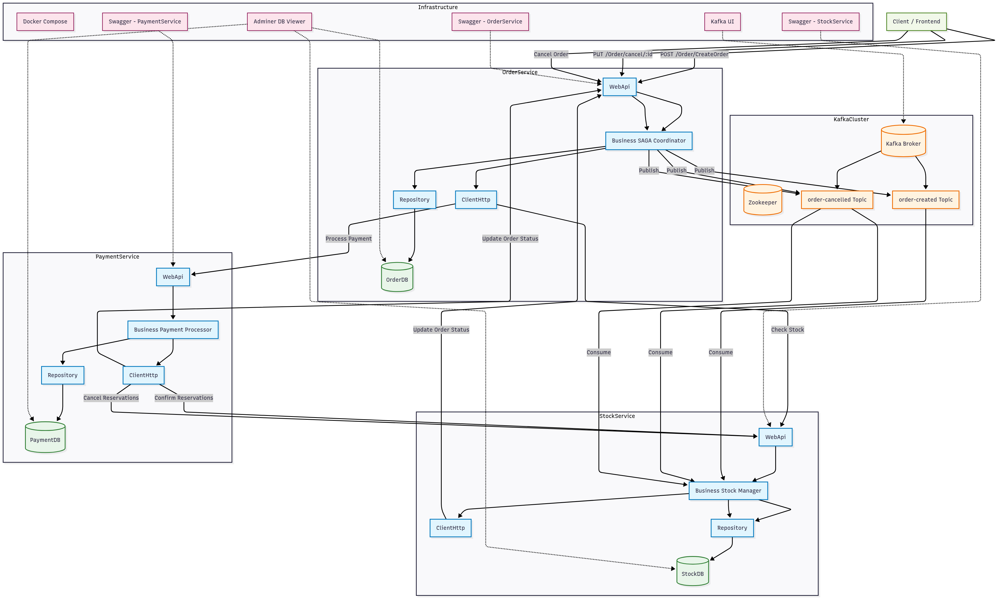
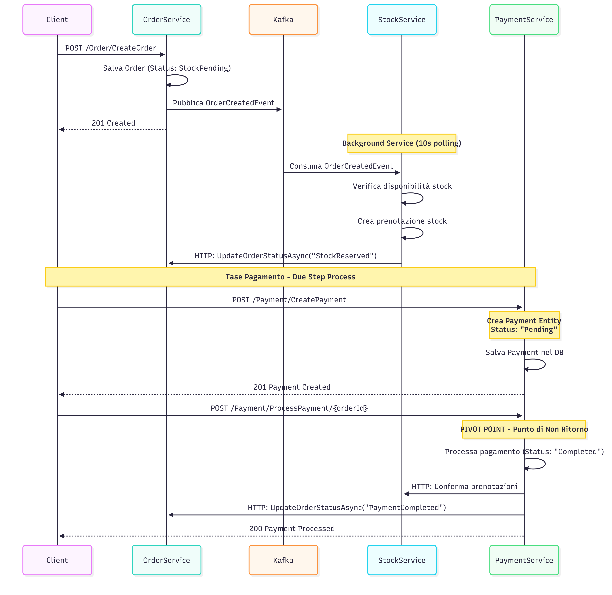
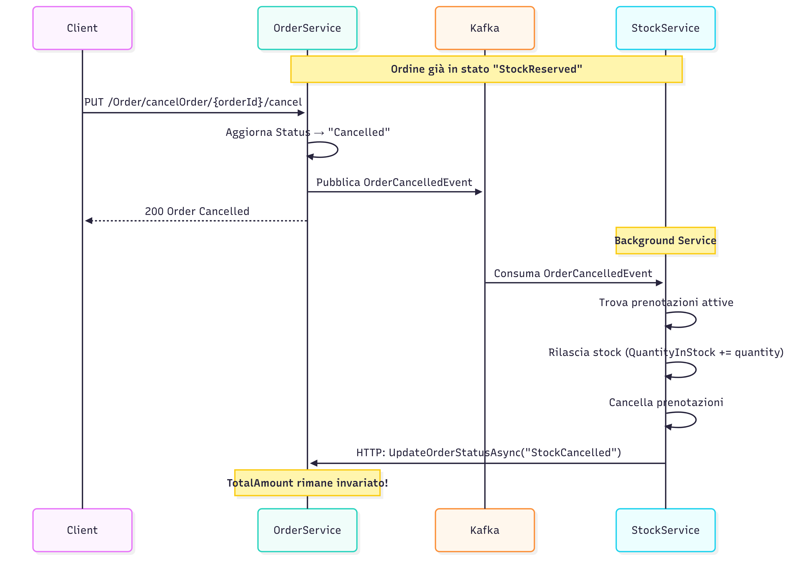
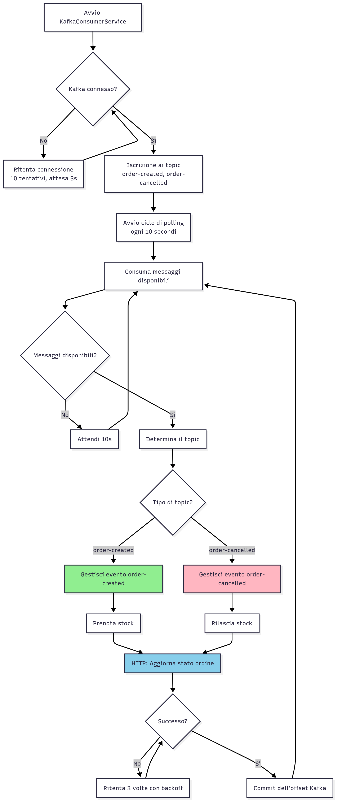
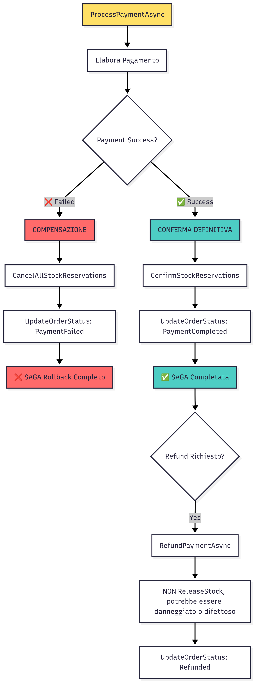

# ShopSaga - E-Commerce Microservices Application

Questo progetto è un'applicazione e-commerce basata su microservizi che implementa il **pattern SAGA coreografico** per transazioni distribuite.

## Architettura

L'applicazione è composta da tre microservizi principali che comunicano tramite HTTP sincrono e Kafka asincrono:

1. **OrderService** (Port 5001): Gestione degli ordini e coordinamento della SAGA
2. **StockService** (Port 5002): Gestione inventario e prenotazioni stock
3. **StockService** (Port 5003): Gestione pagamenti e transazioni pivot

### Struttura dei Servizi

Ciascun microservizio segue una **struttura Clean Architecture a 5 progetti**:

- **WebApi**: API REST, controller, Swagger, health checks
- **Business**: Logica di business, gestione SAGA, validazioni
- **ClientHttp**: Client HTTP per comunicazioni sincrone tra servizi
- **Repository**: Accesso al database tramite Entity Framework Core
- **Shared**: DTO, eventi Kafka, modelli condivisi

## Pattern SAGA Coreografico

Il progetto implementa il **pattern SAGA coreografico** (senza orchestratore centrale) per gestire transazioni distribuite:

### Architettura Completa del Sistema



### Diagramma pagamento



### Diagramma di esempio cancellazione ordine



### Flow chart background service con kafka



### Punto Pivot

- **PaymentService.ProcessPaymentAsync** è il **punto di non ritorno**
- Prima del payment: compensazione possibile (annulla prenotazioni)
- Dopo il payment: solo refund (non rollback completo)



## Tecnologie e Framework

### Backend

- **ASP.NET Core 8.0** - Framework web
- **Entity Framework Core** - ORM e accesso database
- **SQL Server** - Database relazionale
- **Kafka + Zookeeper** - Message broker per eventi asincroni

### Containerizzazione

- **Docker** - Containerizzazione applicazioni
- **Docker Compose** - Orchestrazione multi-container

### Comunicazione

- **HTTP Client** - Comunicazione sincrona tra servizi
- **Kafka Producer/Consumer** - Comunicazione asincrona e eventi SAGA
- **Swagger** - Documentazione API

### Monitoring & Observability

- **Kafka UI** - Interfaccia web per monitoring Kafka
- **Adminer** - Interfaccia web per database

## Struttura del Progetto

```plaintext
ShopSaga/
├── src/
│   ├── OrderService/
│   │   ├── ShopSaga.OrderService.WebApi/         # API Controller, Swagger
│   │   ├── ShopSaga.OrderService.Business/       # Business Logic, SAGA
│   │   ├── ShopSaga.OrderService.ClientHttp/     # HTTP Clients
│   │   ├── ShopSaga.OrderService.Repository/     # EF Core, DbContext
│   │   └── ShopSaga.OrderService.Shared/         # DTO, Events, OrderStatus
│   ├── PaymentService/
│   │   ├── ShopSaga.PaymentService.WebApi/       # Payment API
│   │   ├── ShopSaga.PaymentService.Business/     # Payment Logic, Pivot
│   │   ├── ShopSaga.PaymentService.ClientHttp/   # Service Clients
│   │   ├── ShopSaga.PaymentService.Repository/   # Payment Repository
│   │   └── ShopSaga.PaymentService.Shared/       # Payment DTO
│   └── StockService/
│       ├── ShopSaga.StockService.WebApi/         # Stock API
│       ├── ShopSaga.StockService.Business/       # Stock Logic, Kafka Consumer
│       ├── ShopSaga.StockService.ClientHttp/     # HTTP Clients
│       ├── ShopSaga.StockService.Repository/     # Stock Repository
│       └── ShopSaga.StockService.Shared/         # Stock DTO
├── docker/
│   ├── docker-compose.yml                       # Orchestrazione completa
├── sql/
│   └── init.sql                                  # Script inizializzazione DB
└── README.md
```

## Come Eseguire l'Applicazione

### Prerequisiti

- **Docker Desktop** installato e in esecuzione
- **PowerShell** (per test automatici)

### 1. Avvio Rapido

```bash
# Clone del repository
git clone <repository-url>
cd Shop

# Avvio con Docker Compose
cd docker
docker-compose up -d

# Verifica che tutti i container siano attivi
docker-compose ps
```

### 2. Accesso alle Interfacce

#### API Swagger

- **OrderService**: [http://localhost:5001/swagger](http://localhost:5001/swagger)
- **StockService**: [http://localhost:5002/swagger](http://localhost:5002/swagger)  
- **PaymentService**: [http://localhost:5003/swagger](http://localhost:5003/swagger)

#### Monitoring Tools

- **Kafka UI**: [http://localhost:8080](http://localhost:8080) - Monitoring Kafka topics e messaggi
- **Adminer**: [http://localhost:8081](http://localhost:8081) - Database web interface
  - Server: `sqlserver`, Username: `sa`, Password: `Pass@word1`

## Funzionalità Implementate

## OrderService

- Creazione ordini con validazione stock asincrona  
- Cancellazione ordini con compensazione SAGA completa  
- Publishing eventi Kafka (`OrderCreated`, `OrderCancelled`) con logica di retry  

## StockService

- Gestione prodotti e inventario con Entity Framework  
- Background Service Kafka Consumer con polling resiliente (intervallo 10s)  
- Prenotazioni stock automatiche da eventi `order-created`  
- Compensazione stock (rilascio prenotazioni) da eventi `order-cancelled`  
- Prevenzione overselling con controllo real-time su `QuantityInStock`  
- Multi-topic subscription (`order-created`, `order-cancelled`)  
- Gestione assenza topic con degradazione controllata  

## PaymentService

- Processing pagamenti (punto pivot della SAGA, non reversibile)  
- Refund e cancellazione con compensazione stock coordinata  
- Conferma definitiva prenotazioni stock post-payment  
- Gestione completa del ciclo di vita del pagamento  
- Integrazione HTTP con StockService per conferma e rollback  

## Comunicazione Inter-Service

- Kafka Topics: `order-created`, `order-cancelled` con configurazione resiliente  
- HTTP Client per coordinamento sincrono con timeout gestiti  
- Retry logic per resilienza di rete (3 tentativi con backoff)  
- Error handling robusto con logging strutturato  
- Correlation ID per tracing distribuito  

## Test e Validazione

### Test Implementati

#### 1. Test Funzionali Base

- **Test 1.1**: Health Check di tutti i servizi
- **Test 1.2**: Inizializzazione database e prodotti di test
- **Test 1.3**: Verifica connettività Kafka e topics

#### 2. Test SAGA

- **Test 2.1**: Creazione ordine con stock sufficiente
- **Test 2.2**: Verifica prenotazione automatica stock (Background Service)
- **Test 2.3**: Processo di pagamento completo
- **Test 2.4**: Conferma finale e aggiornamento stato ordine

#### 3. Test Compensazione SAGA

- **Test 3.1**: Cancellazione ordine prima del pagamento
- **Test 3.2**: Rilascio automatico prenotazioni stock
- **Test 3.3**: Verifica consistenza stato ordine "Cancelled"

#### 4. Test Anti-Pattern e Edge Cases

- **Test 4.1**: Prevenzione overselling con stock insufficiente
- **Test 4.2**: Gestione ordini con quantità zero o negative
- **Test 4.3**: Verifica race condition su stock concurrent
- **Test 4.4**: Test resilienza Background Service su Kafka restart

#### 5. Test Resilienza e Recovery

- **Test 5.1**: Retry logic HTTP con servizi temporaneamente offline
- **Test 5.2**: Recovery automatico Background Service dopo interruzione
- **Test 5.3**: Gestione topic Kafka mancanti con graceful degradation

#### Performance Metrics

- **Tempo medio creazione ordine**: ~500ms
- **Tempo prenotazione stock (Background)**: 10s
- **Tempo processing payment**: ~200ms
- **Tempo compensazione completa**: 5-10s
- **Recovery time dopo Kafka restart**: ~30s

#### Event Flow Processing

**OrderCreatedEvent Processing:**

1. Background Service consuma evento da `order-created` topic
2. Verifica disponibilità stock via `IsProductAvailableAsync`
3. Crea prenotazione con `ReserveStockAsync`
4. Aggiorna stato ordine via HTTP: `StockPending` → `StockReserved`
5. Logging completo per debugging e monitoring

**OrderCancelledEvent Processing:**

1. Background Service consuma evento da `order-cancelled` topic  
2. Trova prenotazioni attive per l'ordine
3. Rilascia stock con `ReleaseStockReservationAsync`
4. Aggiorna stato ordine via HTTP: Status → `StockCancelled`
5. Preserva `TotalAmount` durante la transizione

#### Payment Service Pivot Point

```csharp
  // STEP 1: Processa il pagamento internamente
  var payment = await _paymentRepository.ProcessPaymentAsync(orderId, cancellationToken);
  await _paymentRepository.SaveChanges(cancellationToken);
  
  if (payment == null || payment.Status != "Completed")
  {
      _logger.LogWarning("SAGA: Pagamento fallito per ordine {OrderId}", orderId);
      
      // Se il pagamento fallisce, cancella le prenotazioni stock
      await _stockHttp.CancelAllStockReservationsForOrderAsync(orderId, cancellationToken);
      
      // Aggiorna stato ordine a PaymentFailed
      await _orderHttp.UpdateOrderStatusAsync(orderId, "PaymentFailed", cancellationToken);
      
      return MapToDTO(payment);
  }
```

## Problemi Riscontrati

Durante lo sviluppo di questa applicazione SAGA, sono stati identificati e risolti diversi problemi critici:

### 1. Problema UpdateOrderAsync - Gestione Items

**Problema Identificato:**
Nel metodo `UpdateOrderAsync`, Entity Framework presenta un comportamento implicito pericoloso:

- Se includi un item con un ID esistente nella richiesta, viene aggiornato
- Se includi un item con ID = 0, viene creato un nuovo item
- **Se non includi un item esistente, viene rimosso dall'ordine**

**Impatto:**

- Il client deve conoscere e inviare tutti gli items, anche quelli che non intende modificare
- Alto rischio di rimuovere items per errore durante aggiornamenti di stato
- Perdita accidentale del `TotalAmount` durante transizioni SAGA

**Soluzione Implementata:**
Creazione di un metodo dedicato `UpdateOrderStatusAsync` che aggiorna solo lo stato senza toccare gli items.

### 2. Gestione Delete nello StockService

**Problema Identificato:**
Confusione iniziale su quando e come gestire la cancellazione delle prenotazioni stock:

- Cancellazione vs Rilascio prenotazioni
- Gestione dello stock fisico vs prenotazioni temporanee
- Timing della compensazione SAGA

**Soluzione Implementata:**

- **Prenotazioni temporanee**: Create con `ReserveStockAsync`, rilasciate con `ReleaseStockReservationAsync`
- **Stock fisico**: Decrementato solo alla conferma definitiva del pagamento
- **Compensazione**: Rilascio prenotazioni, non cancellazione fisica dello stock

### 3. Operazioni di Compensazione SAGA

**Problema Identificato:**
Complessità nella gestione corretta delle transazioni di compensazione:

- Ordine delle operazioni di rollback
- Gestione stati inconsistenti durante la compensazione
- Retry logic per operazioni di compensazione fallite

**Soluzione Implementata:**

- **Punto Pivot chiaro**: PaymentService come punto di non ritorno
- **Compensazione Before-Pivot**: Annullamento completo (rilascio stock + cancellazione ordine)
- **Compensazione After-Pivot**: Solo refund, stock già confermato
- **Idempotenza**: Tutte le operazioni di compensazione sono sicure da ripetere

### 4. Implementazione Kafka Background Service

**Problema Identificato:**
Gestione robusta del consumer Kafka in ambiente distribuito:

- Connessione resiliente a Kafka broker
- Gestione topic inesistenti o temporaneamente non disponibili
- Polling efficiente senza sovraccarico CPU
- Gestione concorrenza e thread safety

**Problemi Specifici Risolti:**

#### 4.1 Polling Interval Ottimale

- **Problema**: Polling troppo frequente causava overhead CPU
- **Soluzione**: Interval 10 secondi con backoff esponenziale su errori

#### 4.2 Retry Logic e Resilienza

- **HTTP Retry**: 3 tentativi con backoff per chiamate inter-service
- **Kafka Reconnection**: Restart automatico consumer su connection loss
- **Error Isolation**: Un evento fallito non blocca il processing degli altri

#### **Infrastruttura Docker**

**Porte Esposte:**

- **5001**: OrderService API
- **5002**: PaymentService API  
- **5003**: StockService API
- **1433/1434/1435**: SQL Server (Order/Payment/Stock DB)
- **9092**: Kafka Broker
- **2181**: Zookeeper
- **8081**: Kafka UI
- **8082**: Adminer (DB Admin)
